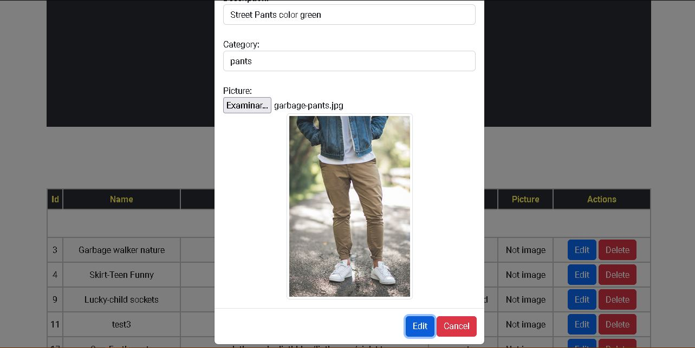
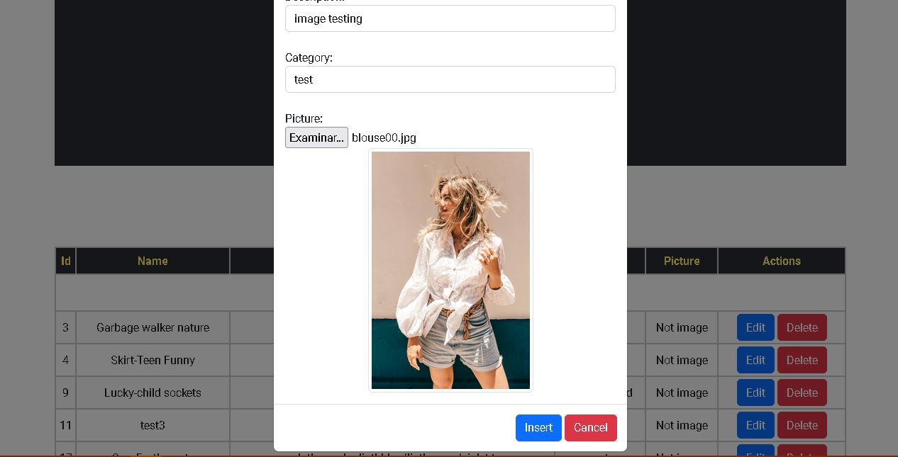
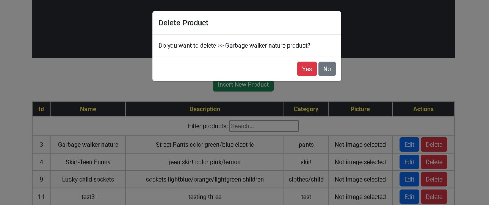
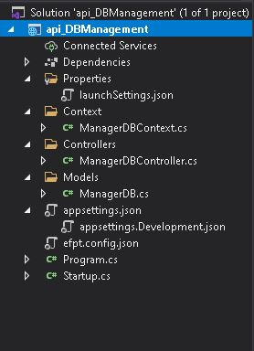
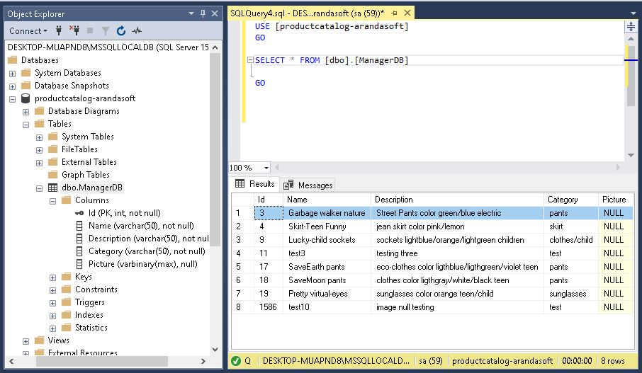

# PRODUCT CATALOG With ASP.NET, SQL Server, & REACTjs

## Description
<br>

This project is a Full-Stack CRUD (Create-Read-Update-Delete) application of a Product Catalog. This products will be managed by API Rest, and showed in a Single-page (ReactJS - Web API).

## Architecture: 3-Layer/Domain.
<br>

### *Presentation layer*: UI (ReactJS) and comunication with application layer

You can deploy the [Web Api from github pages](https://crispthoalex.github.io/products-csharp-crud-sqlserver-react/), too. The CORS was enable for localhost and the repo page

 + Features
	+ useState and useEffect Hooks
	+ Components
 	+ Modal component
	+ Filter and search
	+ [formik](https://www.formik.org) (form package) and [Yup](https://www.npmjs.com/package/yup) (inputs validation package)
<br>

#### Screenshot

##### Web Api


###### _Search feature_


###### _Insert product feature_


###### _Edit product feature_


###### _Delete product feature_

###### Note: Sending image binary to SQL server with CRUD method is pending

<br>

### *Application layer*: Business Logic (API) with C# Lenguage and ASP.NET Core (Entity FrameWork). It allows comunication between Presentation and Data layer by API Restful.

+ Application layer is connected from https://localhost:5001 or http://localhost:5000 . Run the *_api_DBManagement_* application from Microsoft Visual Studio 2019 (or +)

+ [Microsoft.EntityFrameworkCore v5.0.17](https://www.nuget.org/packages/Microsoft.EntityFrameworkCore/)
<br>

### *Data layer*: Data Base managed with Microsoft SQL Server Express.

+ Data Setting

	+ DataBase => Table setting

		+ id: int, not Null

		+ name: varchar(50), not Null

		+ description: varchar(50), not Null

		+ picture: VARBINARY(MAX), to store a large amount of data in a single column, Null.

	+ Example:

		

			
	+ Test: Using [Postman](https://www.postman.com/) and swagger.


### *Domain*: C# lenguage (ASP.NET Core), applying Entity Framework.

<br/>


##### a. Achitecture N-tiers


##### b. Achitecture N-tiers


## Project Structure
### FrontEnd


### API


### DataBase


<br/>


### Tools

* Microsoft SQL Server v18.11.1 2019
* Microsft Visual Studio
* npx - nodejs
* ReactJS Framework
* Bootstrap
* Git


## Try it!

* First, you should download the [Api_DB_Imagetest_CompressedFiles](./Api_DB_image_compressed.zip). You can store this descompressed files outside from this folder

	+ Tips: [How to Import and Export SQL Server Database](https://www.geeksforgeeks.org/how-to-import-and-export-sql-server-database/)

* Second, clone this repo
	+ In *products-csharp-crud-sqlserver-react* repo, you can run the react app from [localhost](http://localhost:3000/):

		| ```` $> npm start ```` |

* Third, remember install MS SQL Server and Visual Studio 2019:

	+ [MS Sql server](https://docs.microsoft.com/en-us/sql/ssms/download-sql-server-management-studio-ssms?view=sql-server-ver16) ([check connection config](https://youtu.be/ORVShW0Yjaw?t=161))

	+ Visual Studio 2019 [Packages: entity framework core (efc), (efc).sqlserver, (efc).tools](https://www.nuget.org) from interface itself


## Reference

+ [SQL Server technical documentation](https://docs.microsoft.com/en-us/sql/sql-server/?view=sql-server-ver15)

+ [Guía de Arquitectura N-Capas
Orientada al Dominio con .NET 4.0](https://resultadoslab.husi.org.co/resources/guia.pdf)

+ [SQL Server + EF Core + ASP.NET Core Web API + CRUD + Load Related Data + Stored Procedures + Views](https://www.youtube.com/watch?v=DoYmpAPoixI)

+ [Image Upload in React with Asp.Net Core Web API](https://youtu.be/ORVShW0Yjaw)

+ [React JS & Asp.Net Core Web API - Image Upload, Retrieve, Update and Delete](https://www.youtube.com/watch?v=jSO5KJLd5Qk)

+ [React Build Custom Search / List Filter Component Tutorial](https://www.positronx.io/react-build-custom-search-list-filter-component-tutorial/)

+ [Search and Filter Data using hooks](https://catalins.tech/search-and-filter-data-in-react-using-hooks)

<br/>

## **Follow me** 💬

| **Author** | **GitHub** | **Twitter** | **Linkedin** |
| :---: | :---: | :---: | :---: |
| Crispthofer Rincon | [crispthoalex](https://github.com/crispthoalex) | [@crispthoalex](https://twitter.com/crispthoalex) | [carmurrain](https://www.linkedin.com/in/carmurrain) |


##### Mayo, 2022. Colombia