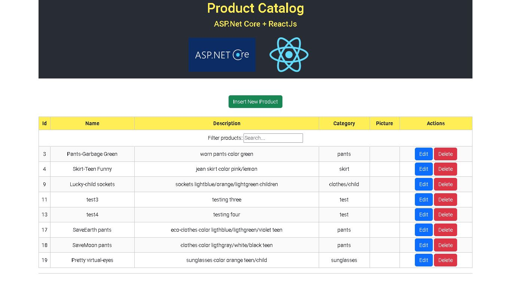
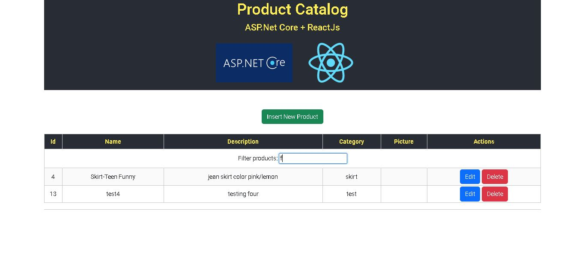
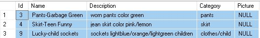
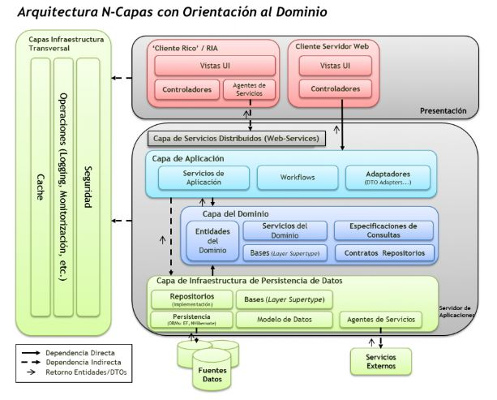
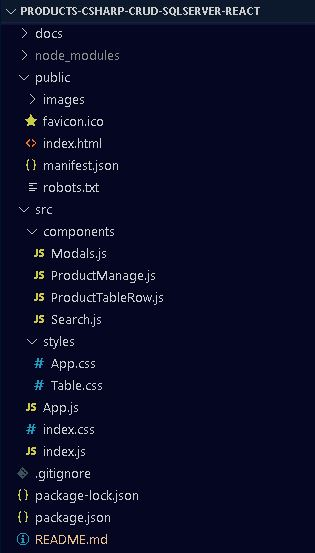

# PRODUCT CATALOG With ASP.NET, SQL Server, & REACTjs

## Description
 

This project is a Full-Stack CRUD (Create-Read-Update-Delete) application of a Product Catalog. This products will be managed by API Rest, and showed in a Single-page (ReactJS - Web API).

## Architecture: 3-Layer/Domain.
 

### *Presentation layer*: UI (ReactJS) and comunication with application layer

 + Features
	+ useState and useEffect Hooks
	+ Components
 	+ Modal component
	+ Filter and search
 

#### Screenshot

##### Web Api

##### Web Api feature search

 

### *Application layer*: Business Logic (API) with C# Lenguage and ASP.NET Core (Entity FrameWork). It allows comunication between Presentation and Data layer by API Restful.

+ [Microsoft.EntityFrameworkCore v5.0.17](https://www.nuget.org/packages/Microsoft.EntityFrameworkCore/)
 

### *Data layer*: Data Base manage with Microsoft SQL Server Express.

+ Data Setting

	+ DataBase => Table setting

		+ id: int, not Null

		+ name: varchar(50), not Null

		+ description: varchar(50), not Null

		+ image: VARBINARY(MAX), to store a large amount of data in a single column, Null.

	+ Example:
		

			
	+ Test: Using [Postman](https://www.postman.com/) and swagger.

### *Domain*: C# lenguage (ASP.NET Core), applying Entity Framework.
 

##### a. Achitecture N-tiers

##### b. Achitecture N-tiers

## Project Structure

##### Folders structure

### Tools

* Microsoft SQL Server v18.11.1 2019
* Microsft Visual Studio
* npx - nodejs
* ReactJS Framework
* Bootstrap
* Git

## Try it!

First, you should download the [DB compressed file](managerdb_sqlserver.zip)

Second, clone this repo

Third, remember install:

+ MS Sql server ([connection config](https://youtu.be/ORVShW0Yjaw?t=161))

+ Visual Studio 2019 [Packages: entity framework core (efc), (efc).sqlserver, (efc).tools](https://www.nuget.org) from interface itself

### Reference

+ [SQL Server technical documentation](https://docs.microsoft.com/en-us/sql/sql-server/?view=sql-server-ver15)

+ [Guía de Arquitectura N-Capas
Orientada al Dominio con .NET 4.0](https://www.google.com/url?sa=t&rct=j&q=&esrc=s&source=web&cd=&cad=rja&uact=8&ved=2ahUKEwi46PbMuvz3AhVATTABHSWJAYIQFnoECCEQAQ&url=https%3A%2F%2Fresultadoslab.husi.org.co%2Fresources%2Fguia.pdf&usg=AOvVaw0Ib2h-KwgGBH0aJ1Ur95_2)

+ [SQL Server + EF Core + ASP.NET Core Web API + CRUD + Load Related Data + Stored Procedures + Views](https://www.youtube.com/watch?v=DoYmpAPoixI)

+ [Image Upload in React with Asp.Net Core Web API](https://youtu.be/ORVShW0Yjaw)

+ [React JS & Asp.Net Core Web API - Image Upload, Retrieve, Update and Delete](https://www.youtube.com/watch?v=jSO5KJLd5Qk)

+ [React Build Custom Search / List Filter Component Tutorial](https://www.positronx.io/react-build-custom-search-list-filter-component-tutorial/)

+ [Search and Filter Data using hooks](https://catalins.tech/search-and-filter-data-in-react-using-hooks)

## Follow me

#### **Follow me** 💬

| **Author** | **GitHub** | **Twitter** | **Linkedin** |
| :---: | :---: | :---: | :---: |
| Crispthofer Rincon | [crispthoalex](https://github.com/crispthoalex) | [@crispthoalex](https://twitter.com/crispthoalex) | [carmurrain](https://www.linkedin.com/in/carmurrain) |

##### Mayo, 2022. Colombia